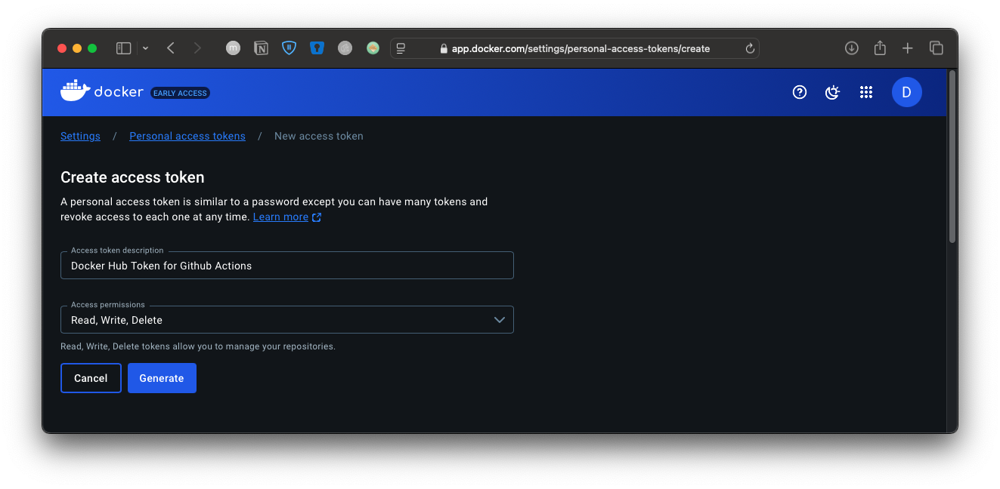
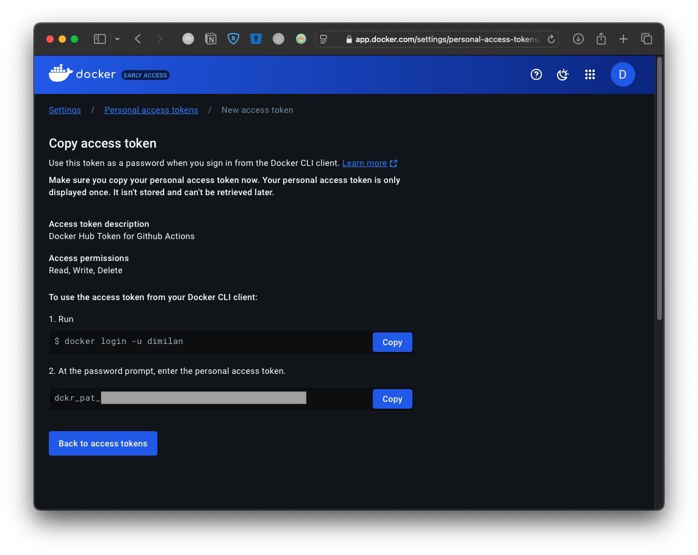
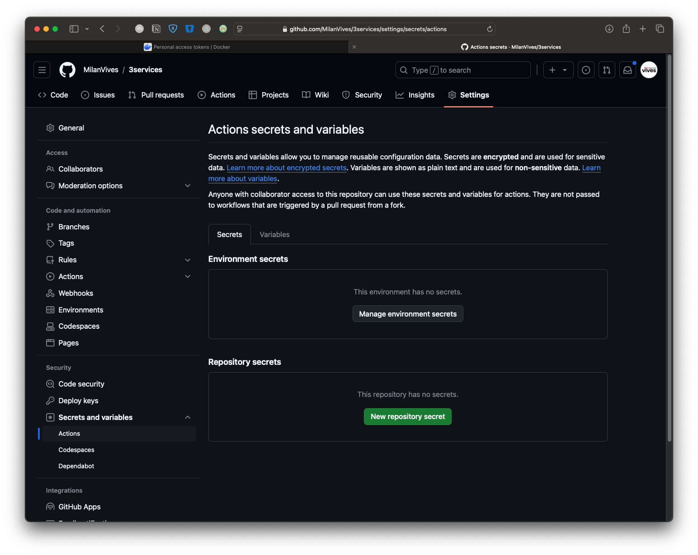
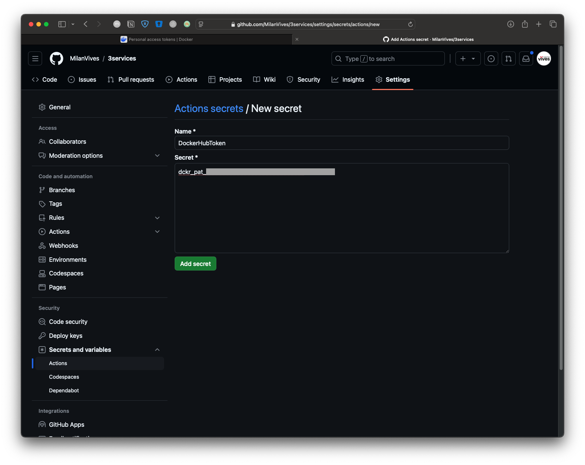
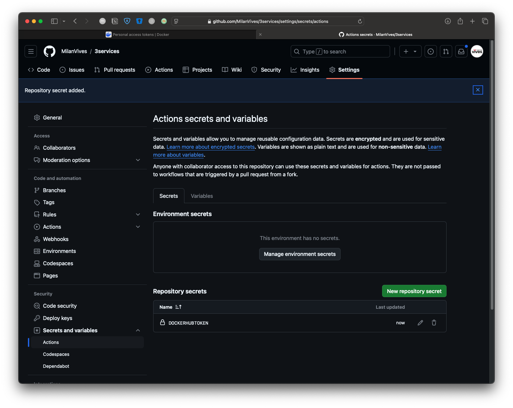

## Readme.md

This repository consists of a Node.js API connected to a MongoDB database and a HTML + Javascript Frontend fetching the data from the backend. 

The main branch contains the Fron- and the backend
The dockerized branch contains the two Dockerfiles and the docker-compose.yaml file
The ci-cd branch contains the GitHub Actions yaml file to automatically build the docker images on push to the repository

### Github Actions

Create Dockerhub token via: 

Account Settings >> Personal Access tokens on hub.docker.com

Create Docker Hub Token (https://app.docker.com/settings/personal-access-tokens/create)




Add DH Token to GA via Repository Settings on Github
Secrets and Variables > Repository Secrets > New Repository secret

One with the name DOCKERHUBTOKEN and the value dckr_pat_... from DockerHub https://app.docker.com/settings/personal-access-tokens/





### Project Directory structure
```
.
|-- Readme.md
|-- backend
|   |-- Dockerfile
|   |-- node_modules
|   |-- package-lock.json
|   |-- package.json
|   `-- server.js
|-- compose.yml
|-- frontend
|   |-- Dockerfile
|   `-- index.html
```

Workflow syntax:
https://docs.github.com/en/actions/writing-workflows/workflow-syntax-for-github-actions

Actions Triggers: 
https://docs.github.com/en/actions/writing-workflows/choosing-when-your-workflow-runs/events-that-trigger-workflows

Conditions:
https://docs.github.com/en/actions/writing-workflows/choosing-when-your-workflow-runs/using-conditions-to-control-job-execution

Runners (environments):
https://docs.github.com/en/actions/writing-workflows/choosing-where-your-workflow-runs/choosing-the-runner-for-a-job

